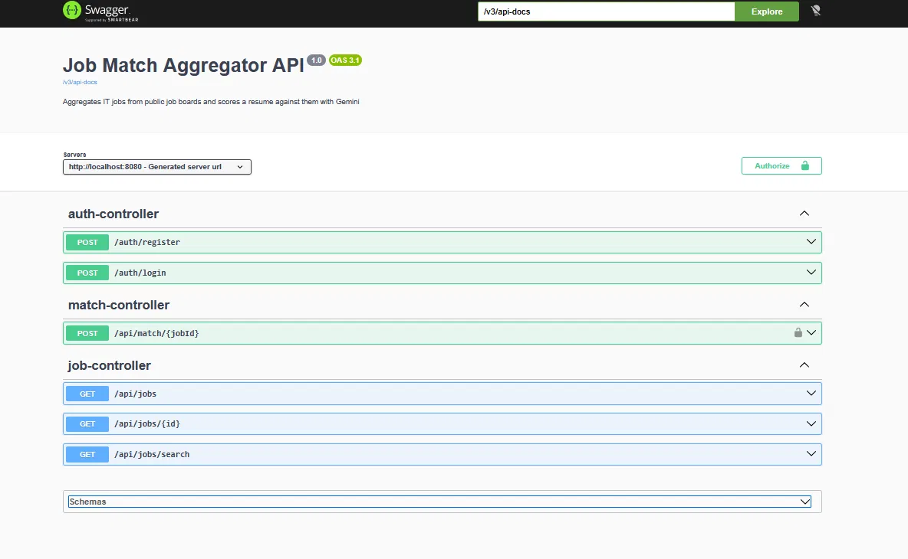

# Job Match Aggregator

A REST API that collects IT job posts from public job boards, stores them in one place, and scores a candidate's resume against any of them using the Gemini API.

Instead of reading a hundred vacancies to find the three that fit you, you send your resume once and get back a match percentage, the skills you have, and the skills you are missing.

**Stack:** Java 21 · Spring Boot 4 · Spring Data JPA · Spring Security (JWT) · PostgreSQL · Redis · Gemini API · JUnit 5 · Mockito · Docker Compose · Swagger

---

## Screenshot



---

## How it works

**Aggregation.** A scheduled task runs every 6 hours and pulls vacancies from **The Muse API** and **Arbeitnow API**. Posts are filtered by IT keywords (configurable in `application.yaml`) and deduplicated by `slug`, so re-running the task updates existing rows instead of creating copies.

**Adding a new job board costs one class.** Every source implements a single interface:

```java
public interface JobSource {
    List<JobEntity> fetchJobs();
}
```

Spring injects every implementation as `List<JobSource>`, and `JobService` iterates over it. A third or fourth board requires no change to the service, the controller, or the scheduler - only a new `@Component`.

**Matching.** `POST /api/match/{jobId}` sends the resume and the job description to Gemini with a fixed `responseSchema`, so the model must answer with structured JSON rather than free text.

**Caching.** Every Gemini call takes seconds. Match results are cached in Redis by job + resume, so the same request never hits the API twice.

**Errors.** A `@ControllerAdvice` maps a custom exception hierarchy onto proper HTTP codes

```json
{
  "error": "unauthorized",
  "message": "Missing, invalid or expired token",
  "localDateTime": "2026-07-13T11:24:51",
  "status": 401,
  "path": "/api/match/5"
}
```

---

## Run it

You need Docker and a free Gemini API key ([get one here](https://aistudio.google.com/apikey)).

```bash
git clone https://github.com/kaliuart/job-match-aggregator.git
cd job-match-aggregator
cp .env.example .env      # put your Gemini key and a JWT secret (min 32 chars) here
docker compose up --build
```

That starts the app, PostgreSQL and Redis. The first job fetch runs at startup.

- API docs: **http://localhost:8080/swagger-ui.html**

---

## Endpoints

| Method | Path                 | Auth | Description                                        |
|--------|----------------------|------|----------------------------------------------------|
| POST   | `/auth/register`     | -    | Create a user                                      |
| POST   | `/auth/login`        | -    | Returns a JWT                                      |
| GET    | `/api/jobs`          | -    | All jobs, paginated and sortable                   |
| GET    | `/api/jobs/{id}`     | -    | A single job                                       |
| GET    | `/api/jobs/search`   | -    | Filter by `keyword`, `location`, `remote`          |
| POST   | `/api/match/{jobId}` | JWT  | Score a resume against a job                       |

---

## Example

Get a token:

```bash
curl -X POST http://localhost:8080/auth/login \
  -H "Content-Type: application/json" \
  -d '{"email": "test@test.com", "password": "Test1234#"}'
```

Score a resume against job `5`:

```bash
curl -X POST http://localhost:8080/api/match/5 \
  -H "Authorization: Bearer <token>" \
  -H "Content-Type: application/json" \
  -d '{"resume": "Java developer, 2 years. Spring Boot, PostgreSQL, Redis, Docker, JWT, REST, JUnit, Mockito."}'
```

```json
{
  "matchPercentage": 78,
  "matchedSkills": ["Java", "Spring Boot", "PostgreSQL", "Docker"],
  "missingSkills": ["Kafka", "Kubernetes"],
  "experienceMatch": "Slightly below the required 3 years",
  "summary": "Strong backend fundamentals and a good stack overlap. No messaging or orchestration experience.",
  "recommendation": "Worth an interview for a junior position."
}
```

---

## Tests

```bash
./mvnw test
```

Unit tests with JUnit 5 and Mockito cover the services, the mapper and the JWT logic: deduplication, keyword filtering, the "job not found" path, invalid credentials, duplicate email, and token generation/validation.

---


## Configuration

All secrets come from environment variables - see `.env.example`.

| Variable            | Purpose                                       |
|---------------------|-----------------------------------------------|
| `POSTGRES_PASSWORD` | Password for the Postgres container            |
| `JWT_SECRET`        | HMAC signing key, minimum 32 characters        |
| `GEMINI_API_KEY`    | Google AI Studio key                           |
